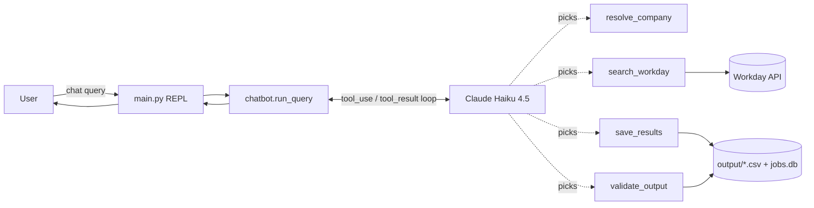

# job-chatbot-single-call

A conversational job-search chatbot that fetches every matching posting from
a company's Workday careers site and saves it as a clean CSV + SQLite
snapshot — built with **one Claude call and four tools**. No sub-agents,
no orchestration framework, no graph.

---

## For Non-Technical Users

This is the simplest of the five sibling implementations. Where the others
use multiple AI agents that talk to each other, this one uses a single AI
call that knows about all the tools and figures out the order itself. Same
result, less moving parts.

You type *"find AI jobs at PwC in Bangalore"* and a few seconds later you
have a spreadsheet on your computer listing every matching role — title,
location, posted date, and a direct link to apply. Behind the scenes one
Claude call sees four tools (find the company, search Workday, save the
file, double-check the file) and decides for itself in what order to use
them.

### What you'll need

- macOS, Linux, or Windows (with WSL/Git Bash on Windows).
- Python 3.11 or newer.
- An Anthropic API key — sign up at
  [console.anthropic.com](https://console.anthropic.com).
- `uv` — install with `curl -LsSf https://astral.sh/uv/install.sh | sh`.

### Quick start

```bash
git clone git@github.com:mahadevaiahrashmi/job-chatbot-single-call.git
cd job-chatbot-single-call

uv venv
uv sync

cp .env.example .env
# edit .env and paste your ANTHROPIC_API_KEY

uv run job-chatbot-single-call
```

The friendly, step-by-step walkthrough is in
**[`docs/USER-MANUAL.md`](docs/USER-MANUAL.md)**. Start there if you don't
write code.

### Supported companies

Eight Workday-hosted careers sites today: Adobe, Cisco, JPMorgan Chase,
Netflix, NVIDIA, PricewaterhouseCoopers, Salesforce, and Workday. Common
aliases (`pwc`, `jp morgan`, `sfdc`, …) resolve automatically.

### Example session

```
you> find AI jobs at PwC in Bangalore
+- result -------------------------------------------------------------+
| Found 17 AI postings at PricewaterhouseCoopers in Bangalore.         |
| Saved to output/pricewaterhousecoopers_ai_2026-05-25.csv             |
| and upserted into output/jobs.db. Validation: all 4 checks passed.   |
+----------------------------------------------------------------------+
```

Type `companies` at the prompt to list supported companies, `quit` to exit.

---

## For Developers

### Architecture in one paragraph

A single `client.messages.create` call in a loop, with all four tools
registered up front: `resolve_company`, `search_workday`, `save_results`,
`validate_output`. Claude reads the user's request, picks a tool, gets the
result, picks another tool, and so on until `stop_reason == "end_turn"`.
There is no Python orchestrator deciding the order — that's the whole
point. No agent graph, no per-stage system prompt, no inter-agent
serialisation. Just one model + four well-described tools.



### Tech stack

- **anthropic** (`>=0.40`) — the only LLM dependency.
- **httpx** — Workday HTTP client.
- **rich** — REPL panels.
- **python-dotenv** — `.env` loading.
- **uv** — environment + dependency management.
- **pytest** — offline smoke tests.

### Code layout

```
job-chatbot-single-call/
├── pyproject.toml
├── README.md
├── LICENSE
├── .env.example
├── docs/
│   ├── USER-MANUAL.md
│   └── SYSTEM-DESIGN.md
├── src/job_chatbot_single_call/
│   ├── main.py        # CLI: argparse + REPL
│   ├── chatbot.py     # the single tool-use loop
│   ├── tools.py       # 4 tool schemas + dispatcher
│   ├── workday.py     # Workday client + job-ID regex
│   ├── companies.py   # 8-company registry + alias map
│   ├── storage.py     # CSV + SQLite writers
│   └── models.py      # JobQuery, JobPosting dataclasses
├── tests/test_smoke.py
└── output/            # gitignored CSVs + jobs.db land here
```

Note: there is no `agents/` subfolder. There is no orchestrator. That is
deliberate.

### Dev quickstart

```bash
uv venv
uv sync
uv run pytest -q                     # offline smoke suite, no network
uv run job-chatbot-single-call       # interactive REPL
uv run job-chatbot-single-call -q "find AI jobs at PwC in Bangalore"
```

### When this design wins

- **Linear pipelines of cheap tool calls.** No coordination overhead.
- **You want one place to debug.** A single transcript shows everything.
- **Token budget matters.** No per-stage system prompts, no agent-to-agent
  framing — typically 1/3 to 1/2 the tokens of the multi-agent siblings.
- **Latency matters.** Fewer network round trips to Anthropic.
- **Tool descriptions are good.** When the schemas carry the intent, you
  don't need a per-stage prompt to disambiguate.

### When this design loses

- **You need different system prompts per stage** (e.g. one stage refuses
  to invent data, another is allowed to be creative).
- **You want different models per stage** (Haiku for quick, Sonnet for
  the careful one).
- **You want crash isolation** so a flaky tester can't break the scraper.
- **You want to swap one stage independently** without re-deploying the
  rest.
- **You want parallel execution** of independent stages.

For the full comparison with the four multi-agent siblings — token counts,
latency, lines of code, debuggability — see
**[`docs/SYSTEM-DESIGN.md`](docs/SYSTEM-DESIGN.md)**.

---

## License

MIT — see [`LICENSE`](LICENSE).
