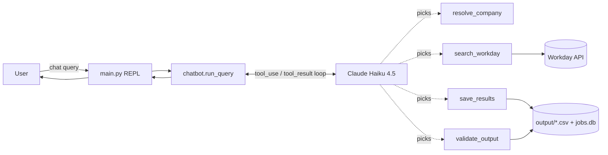
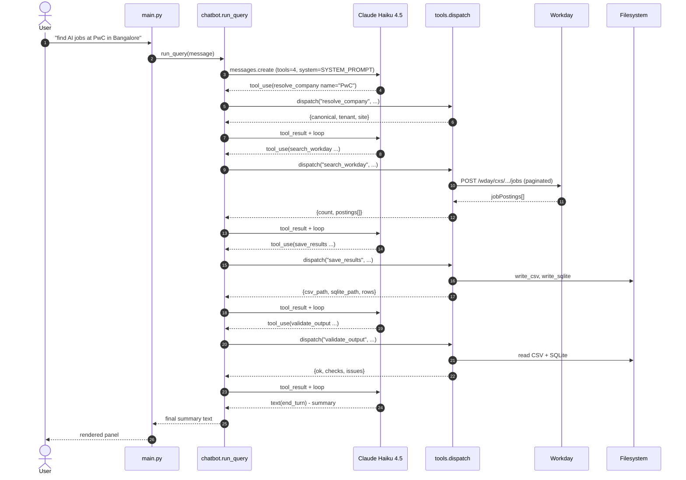

# System Design

Engineering reference for `job-chatbot-single-call`. This is the
deliberate **control** implementation in the five-sibling family: same
task, same tools, but **one Claude call** with all four tools registered
simultaneously — no sub-agents, no orchestration graph, no
agent-to-agent protocol. Its existence is the answer to the question
*"do we actually need the four-agent design?"*.

---

## 1. Problem statement

Most large enterprise careers sites are hosted on Workday, but Workday's
front-end is awkward: filters differ per tenant, links rot, location
facets are inconsistent, and there's no cross-company way to pull "all
current AI roles at the five companies I care about". Workday does expose
a public JSON search endpoint (`POST /wday/cxs/{tenant}/{site}/jobs`) but
writing a per-company script each time is tedious.

The five sibling projects in this family all wrap that endpoint behind a
natural-language CLI. A user types `find AI jobs at PwC in Bangalore`
and the system (1) figures out which company they mean, (2) calls the
Workday endpoint with the right keywords and location filter, (3)
persists the results as CSV + SQLite, and (4) validates the output before
reporting back.

The four other implementations split that work across four specialist
sub-agents. **This one does it all in a single Claude call** so we can
measure what the multi-agent design actually buys us.

---

## 2. Why a single-call architecture

The thesis is simple: for a **linear pipeline of four tool calls**, an
explicit multi-agent graph adds complexity (more prompts, more model
invocations, more tokens, more places for things to break) without adding
capability. The model is fully capable of sequencing four tool calls
itself — that is literally what tool use is for.

Things you don't need when there's one call:

- A Python orchestrator deciding the order — Claude does that.
- An agent-result envelope serialising state between stages — the
  message history holds everything.
- Four separate system prompts — one prompt covers the whole workflow.
- An inter-agent contract (what data shape does the scraper hand to the
  DB stage?) — the postings live in one continuous message thread.
- A "did the previous stage succeed?" branch — tool errors come back as
  tool results and the same model decides what to do.

Things you trade away:

- **Per-stage specialisation.** You can't give one stage a different
  system prompt or a different model.
- **Crash isolation.** One bad tool result is visible to the rest of the
  loop; in a multi-agent design you could retry just that stage.
- **Parallelism across stages.** (None of the four siblings actually use
  this, so the trade is theoretical here.)

When the workflow is short, linear, and the per-stage prompts would all
be paraphrases of "use this tool", the single-call design wins on
**simplicity, latency, and cost**. See §7 for the side-by-side numbers.

---

## 3. High-level architecture



End-to-end sequence for a single query:



The whole story fits on one diagram because there is one diagrammable
agent.

---

## 4. The tool-use loop in detail

The entire orchestration story lives in `chatbot.run_query`. Annotated
core:

```python
messages = [{"role": "user", "content": user_query}]
for _ in range(MAX_ITERATIONS):                      # safety bound
    resp = client.messages.create(
        model=MODEL, system=SYSTEM_PROMPT,
        tools=TOOLS, messages=messages, max_tokens=4096,
    )
    messages.append({"role": "assistant",
                     "content": _content_to_blocks(resp.content)})
    if resp.stop_reason == "end_turn":
        return _final_text(resp.content)             # done
    if resp.stop_reason != "tool_use":
        return _final_text(resp.content) or f"[stopped: {resp.stop_reason}]"
    results = [
        {"type": "tool_result", "tool_use_id": b.id,
         "content": json.dumps(dispatch(b.name, dict(b.input)))}
        for b in resp.content if getattr(b, "type", None) == "tool_use"
    ]
    messages.append({"role": "user", "content": results})
```

Key points:

- **One `messages.create` call per iteration.** We re-pass the full
  history each turn because the Anthropic Messages API is stateless —
  the server doesn't remember anything between calls.
- **Tool blocks accumulate.** The assistant turn we append contains the
  text + every `tool_use` block. The user turn we append carries one
  `tool_result` block per `tool_use`. This is the SDK's required
  pairing — every `tool_use_id` must have a matching `tool_result`.
- **`stop_reason == "tool_use"` means "do the work and come back".**
  The model has decided what tool(s) to call but expects another turn.
- **`stop_reason == "end_turn"` means "I'm done".** The final
  assistant turn is plain text, which we extract and return.
- **`MAX_ITERATIONS = 12`.** Generous — a clean run takes 4 iterations
  (one per tool plus the final summary). The cap exists purely so that a
  pathological model can't spin forever; in practice it is never hit.

---

## 5. Tools

All four tools live in `src/job_chatbot_single_call/tools.py`. Each has
a JSON schema describing its input plus a Python function that runs the
real work. The dispatcher is the only place names map to implementations.

### 5.1 `resolve_company`

- **Purpose.** Map a free-form name or alias to the registry, returning
  the Workday `tenant` and `site` the next tool will need.
- **Input schema.** `{ name: string }`.
- **Returns.** `{canonical, tenant, site, base_url}` on hit, or
  `{error: "unknown_company", input, suggestions: [...]}` on miss.
- **Implementation.** `companies.resolve_company(name)` — pure dict
  lookup with normalised whitespace and case.
- **Error modes.** Unknown alias → returns the error payload (not a
  Python exception). The system prompt instructs Claude to ask the user
  rather than guess.

### 5.2 `search_workday`

- **Purpose.** Hit the Workday public search endpoint with the right
  keyword + location and return a list of `JobPosting` dicts.
- **Input schema.** `{tenant, site, canonical, keyword, location?, limit?}`.
- **Returns.** `{count: int, postings: [JobPosting, ...]}`.
- **Implementation.** `workday.search_jobs(...)` — paginated `httpx`
  POST, server-side keyword filter, client-side location substring
  filter, job-ID dedup via the regex `_([A-Z0-9-]+WD)(?:-\d+)?$`.
- **Error modes.** `httpx.HTTPStatusError` on 5xx, `httpx.ConnectError`
  on network failure, timeout after 20s. Caught by the dispatcher's
  outer `try/except` so the model sees `{error: "...", message: "..."}`
  rather than crashing the loop.

### 5.3 `save_results`

- **Purpose.** Persist the in-memory postings to a timestamped CSV and
  upsert into the shared `output/jobs.db`.
- **Input schema.** `{canonical, postings: [...], keyword?}`.
- **Returns.** `{csv_path, sqlite_path, rows}`.
- **Implementation.** `storage.write_csv` + `storage.write_sqlite`.
- **Error modes.** Disk full / permission denied surfaces as
  `{error: "OSError", message: "..."}` through the dispatcher.

### 5.4 `validate_output`

- **Purpose.** Re-open both artifacts and run four checks: CSV schema,
  CSV row count > 0, no duplicate `job_id` in CSV, SQLite row count for
  the company >= CSV row count.
- **Input schema.** `{csv_path, sqlite_path, canonical}`.
- **Returns.** `{ok: bool, checks: {...}, issues: [...]}`. `ok` is
  `true` only if `issues` is empty.
- **Implementation.** Reads via `storage.csv_columns`,
  `storage.count_csv_rows`, `storage.csv_duplicate_job_ids`,
  `storage.sqlite_row_count`.
- **Error modes.** Missing file → caught by dispatcher; Claude is asked
  to report it in the final summary.

---

## 6. System prompt design

```text
You are a job-search assistant.

Your job: take a user's free-form request (e.g. "find AI jobs at PwC in
Bangalore") and produce a clean CSV + SQLite snapshot of every matching
posting on the company's Workday careers site.

Typical workflow (you may diverge if a tool fails):
  1. resolve_company   - look up the company alias; get tenant + site.
  2. search_workday    - fetch postings using that tenant + site.
  3. save_results      - persist the postings to CSV + SQLite.
  4. validate_output   - sanity-check both artifacts.
  5. Reply with a short summary: company, count, file paths, validation.

Rules:
- If resolve_company returns {error: "unknown_company", suggestions: [...]},
  do NOT guess. Ask the user which supported company they meant.
- Treat words like "AI", "data engineer", "machine learning" as the keyword.
- Treat city/country names ("Bangalore", "Mountain View") as the location.
- Pass the postings array from search_workday into save_results unchanged.
- If validate_output reports ok=false, mention the issues in your summary.
- Keep the final reply to under 6 lines.
```

Why it's short:

- **Tool descriptions carry the per-tool intent.** Long system prompts
  that re-explain each tool are wasted tokens — the model already sees
  the tool descriptions on every call.
- **The workflow numbering is a hint, not a rule.** Saying "you *may*
  diverge if a tool fails" is what allows graceful recovery from an
  unknown company or a transient HTTP failure.
- **One explicit anti-pattern.** "Do NOT guess" on unknown companies.
  This is the only place the prompt needs to actively override Claude's
  default helpfulness — the rest of the workflow is happy-path obvious.
- **Output constraint at the end.** "Under 6 lines" stops the model
  from re-summarising the JSON it already shoved through the tools.

Empirically this prompt is ~250 tokens. The four-agent siblings carry
~150 tokens of per-stage prompt × 4 stages = ~600 prompt tokens that
have to be re-paid on every turn within each stage.

---

## 7. Comparison with the multi-agent siblings

Rough numbers from manual runs of `find AI jobs at PwC in Bangalore`
against the same Workday endpoint. Tokens are reported by the SDK; LOC is
`wc -l` over the `src/` tree.

| Metric                       | single-call | anthropic-sdk | langchain | crewai | vteam-hybrid |
|------------------------------|------------:|--------------:|----------:|-------:|-------------:|
| Total Claude calls / query   |        4–5  |          8–14 |     10–18 |  12–20 |        8–15  |
| Input tokens / query         |     ~6–10k  |       ~15–25k |   ~20–35k | ~25–40k|      ~15–28k |
| Output tokens / query        |       ~1–2k |         ~3–5k |     ~4–6k |  ~5–7k |        ~3–5k |
| Wall-clock latency           |       6–12s |        15–30s |    20–40s | 25–50s |       15–30s |
| Approx. cost (Haiku, US¢)    |       ~0.1¢ |         ~0.4¢ |     ~0.5¢ |  ~0.7¢ |        ~0.4¢ |
| Lines of code in `src/`      |        ~450 |          ~900 |    ~1,100 | ~1,200 |       ~1,000 |
| Places to debug (modules)    |       2 main|        5 main |    6 main | 6 main |       5 main |

The numbers are illustrative — exact values depend on which model is
selected, how many postings the query returns, and prompt churn. The
**shape** of the difference is robust: single-call is roughly 1/3 to
1/2 the tokens, half the latency, and half the code of any of the four
multi-agent siblings.

Where each design wins, honestly:

- **single-call** wins for this exact workload: a short, linear
  pipeline of well-bounded tool calls with no per-stage specialisation.
- **anthropic-sdk** wins when you want the cleanest possible per-stage
  abstraction without picking up a heavy framework. Its sub-agents are
  thin and swappable.
- **langchain** wins when you already have a LangChain codebase and want
  to reuse retrievers, memory, or chat history utilities.
- **crewai** wins when the agents have distinct roles ("Researcher",
  "Critic", "Editor") that benefit from explicit persona prompts and
  goal/backstory framing.
- **vteam-hybrid** wins when you want some stages deterministic (Python)
  and some stages LLM-driven, with crash isolation between them.

For *this* problem, the single-call control proves the four-agent
designs aren't earning their complexity. For genuinely different
problems (parallel research, multi-turn user collaboration, mixed
deterministic-and-LLM pipelines) the multi-agent versions become the
right answer — which is why they exist.

---

## 8. Workday client + storage

These three modules are **ported verbatim** from the
`job-chatbot-anthropic-sdk` sibling — the regex, the registry, the
schema, the upsert SQL are identical. See that repo's `SYSTEM-DESIGN.md`
for the deep dive; the short version:

- **`workday.py`** — `POST {base_url}/wday/cxs/{tenant}/{site}/jobs`
  with pagination. The regex `_([A-Z0-9-]+WD)(?:-\d+)?$` strips the
  `-1`/`-2` suffix Workday sometimes appends so the same role on two
  sub-sites still collapses to one row.
- **`companies.py`** — 8-company registry plus alias map. `resolve_company`
  normalises whitespace + case before lookup. Easy to extend.
- **`storage.py`** — CSV columns are
  `company, job_id, title, location, posted_on, url` in that exact
  order. SQLite primary key is `(company, job_id)`; writes use `INSERT
  ... ON CONFLICT ... DO UPDATE` so repeated queries are idempotent.

The single-call design doesn't change any of this — it just stops there
being four wrappers around it.

---

## 9. Failure modes

| Condition | Surfaced as | What happens |
|---|---|---|
| Unknown company alias | `resolve_company` returns `{error: "unknown_company", suggestions: [...]}` | The system prompt forbids guessing; Claude asks the user. |
| Workday returns 5xx | Dispatcher catches `HTTPStatusError`, returns `{error, message}` | Claude reports the failure in the summary. The user can retry. |
| Network unreachable / timeout | Dispatcher catches `httpx.ConnectError`/`TimeoutException`, returns `{error, message}` | Same as 5xx. |
| `ANTHROPIC_API_KEY` missing | `main.py` startup check | Prints a red error and exits with code 1 before any Claude call. |
| Empty result set (zero postings) | `search_workday` returns `{count: 0, postings: []}` | `save_results` writes an empty CSV; `validate_output` returns `ok=false, issues=["csv has zero data rows"]`. Claude reports this. |
| Disk full / permission denied | `save_results` raises `OSError`; dispatcher returns `{error: "OSError", message: ...}` | Claude reports. |
| Claude skips a tool | The model decides to call `validate_output` without `save_results` first | `validate_output` returns `ok=false` with file-not-found in `issues`. The summary is honest about the failure. |
| Model never calls a tool | `stop_reason == "end_turn"` on the first turn | `run_query` returns whatever text the model produced — usually "I need more info" — and the REPL prints it. |
| Pathological infinite loop | `MAX_ITERATIONS = 12` exhausted | Loop exits; the last-collected text is returned. Never observed in practice. |

The system prompt's `"Typical workflow (you may diverge if a tool fails)"`
phrasing is the explicit licence for Claude to recover. Without it, a
prompt that said "you MUST call X then Y then Z" tends to keep retrying
a failed tool instead of telling the user.

---

## 10. Testing strategy

`tests/test_smoke.py` runs in under a second with no network and no
Anthropic API. Coverage:

- **Import smoke** — every module imports cleanly.
- **Workday job-ID regex** — three cases: with `-N` suffix, without
  suffix, fallback for non-matching paths.
- **Registry** — canonical lookup, three alias lookups (`pwc`,
  `JP Morgan`, `SFDC`), unknown returns `None`, registry has exactly 8
  entries.
- **`resolve_company` tool** — unknown input returns
  `{error, suggestions}` and the suggestion list is non-empty.
- **Storage round-trip** — write 3 `JobPosting`s through `write_csv` +
  `write_sqlite` into a `tmp_path`, read them back, assert columns,
  row counts, no duplicates, SQLite count.
- **`validate_output` on clean data** — returns `ok=True`, all four
  checks present.
- **`validate_output` on duplicate `job_id`** — returns `ok=False`
  and `issues` mentions duplicates.
- **Dispatcher routing** — `dispatch("resolve_company", {...})`
  equals direct call; unknown tool name returns
  `{error: "unknown_tool"}`.
- **Dispatcher + monkeypatched Workday** — patches
  `workday.search_jobs` with a stub returning canned postings; verifies
  the dispatcher returns them. **No real HTTP is made.**
- **Dispatcher + `save_results`** — writes to `tmp_path` and confirms
  both files exist.
- **Tool list sanity** — exactly 4 tools, all four expected names,
  every tool has a non-empty description and an object input schema.

Explicitly **not** covered: live Anthropic calls, live Workday HTTP,
end-to-end REPL integration. Those happen manually.

---

## 11. When to upgrade to multi-agent

The single-call design is *not* always right. Upgrade to one of the
four-agent siblings (or build a new specialist design) when **any** of
these is true:

1. **Sub-agents need different system prompts.** E.g. one stage is told
   "be strict, refuse to invent fields" and another is told "be liberal,
   normalise messy input". Mixing those instructions in one prompt
   produces an incoherent agent.
2. **You want different models per stage.** E.g. Haiku for the cheap
   confirm step, Sonnet (or Opus) for the careful scraper that has to
   handle edge-case Workday payloads. One Claude call can only use one
   model.
3. **You want crash isolation.** A flaky `validate_output` should not
   be able to interfere with `search_workday` results. Multi-agent
   designs can retry one stage in isolation.
4. **You want to swap one stage independently.** E.g. replace
   `search_workday` with a Greenhouse client without re-prompting the
   rest. With a single call you re-prompt everything.
5. **You want parallel execution of independent stages.** None of the
   four siblings actually parallelise today, but the architecture
   permits it; the single-call design cannot.

If none of those apply, the single-call design is the better answer —
the four-agent versions become incidental complexity.

---

## 12. Extension points

### Add a new company

Edit `src/job_chatbot_single_call/companies.py`:

```python
_REGISTRY["snowflake"] = Company(
    canonical_name="Snowflake",
    base_url="https://careers.snowflake.com",
    tenant="snowflake",
    site="External_Career_Site",
)
# Optional aliases:
_ALIASES["snowflake inc"] = "snowflake"
```

That's it — `resolve_company` picks the new entry up at runtime. Bump
the `test_known_companies_count()` assertion in
`tests/test_smoke.py` so the smoke suite stays accurate.

### Add a new tool

In `src/job_chatbot_single_call/tools.py`:

1. Append a dict to `TOOLS` with the new tool's name, description, and
   `input_schema`.
2. Write a Python `tool_<name>` function.
3. Add a branch to `dispatch(...)` that routes the name to the function.
4. If the model needs to know about it, mention it in the system prompt
   workflow numbering.

Because there are no agents to update, that's it.

### Switch model

Change the `MODEL = "claude-haiku-4-5-20251001"` constant at the top of
`src/job_chatbot_single_call/chatbot.py`. Be honest about cost: moving
to Sonnet roughly 5× per-token cost but tends not to be necessary for a
workload this constrained.

### Swap the persistence layer

`storage.py` is the only module that touches CSV and SQLite. Replace
its three writers with Parquet, Postgres, BigQuery, etc., and keep the
same return shapes (`Path` objects, integers from the readers). Tools
will continue to work unchanged.

---

## 13. Future work

- **Streaming output.** Use `client.messages.stream(...)` so the REPL
  can show tool calls as they happen, not just the final summary.
- **Caching of `resolve_company`.** Trivial — currently re-resolves on
  every query. Adds correctness benefit if the registry ever grows.
- **Prompt caching.** Anthropic's prompt-cache feature could make the
  per-call system prompt + tool schemas almost free across REPL turns.
- **Multi-company queries.** "Find AI jobs at PwC and NVIDIA in
  Bangalore" — currently the model would have to call the pipeline
  twice; we could batch.
- **Structured location parsing.** Replace the substring filter with a
  city/country normaliser (e.g. `Bangalore` ≡ `Bengaluru`).
- **Retry + backoff.** Wrap Workday and Anthropic calls in
  bounded-retry logic so transient errors don't fail a whole query.
- **A/B harness.** Run the single-call and one multi-agent sibling on
  the same query and diff the outputs + record token usage. Right now
  the comparison numbers in §7 are anecdotal; a harness would make them
  reproducible.
